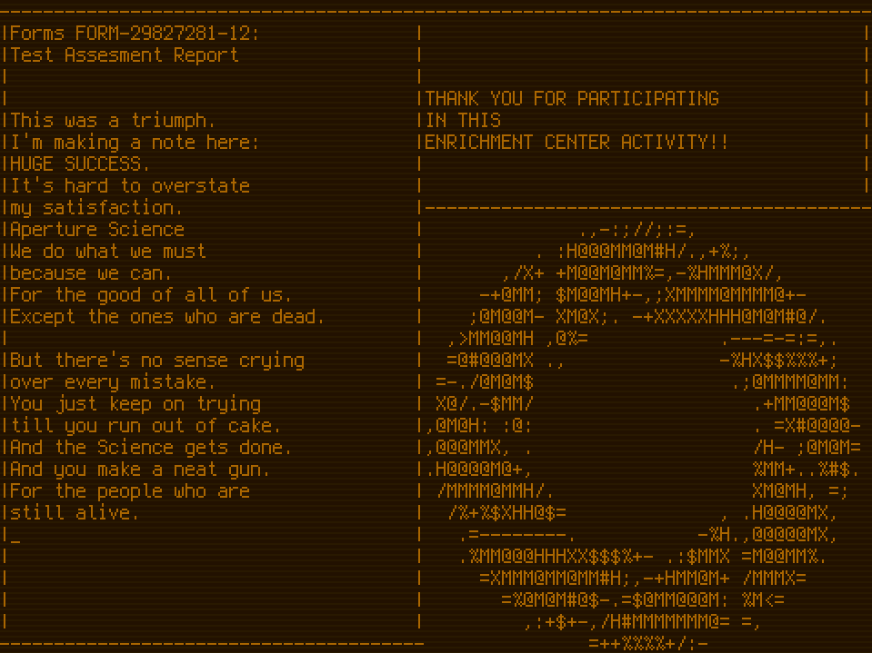

# Remake of the Portal game credits ('Still Alive' song)

## Screenshot:



## Full video:


## Dependencies:

* [station-app](https://github.com/ivanp7/station)
* SDL2

## Build dependencies:

* gcc-compatible compiler (like clang)
* objcopy
* pkg-config
* make

## How to build:

1. Download and build the [station-app](https://github.com/ivanp7/station)
    * configure with the recommended flags: `./configure -aoAM`
    * build: `ninja -v`
    * `build/libstation-app.a` will be built

2. Build this project
    * you may need to edit value of `STATION_PATH` in `Makefile`,
    it must be a path to the directory containing `station-app.pc` file
    * build: `make`
    * `still-alive` will be built

## How to run:

```
$ ./still-alive
```

