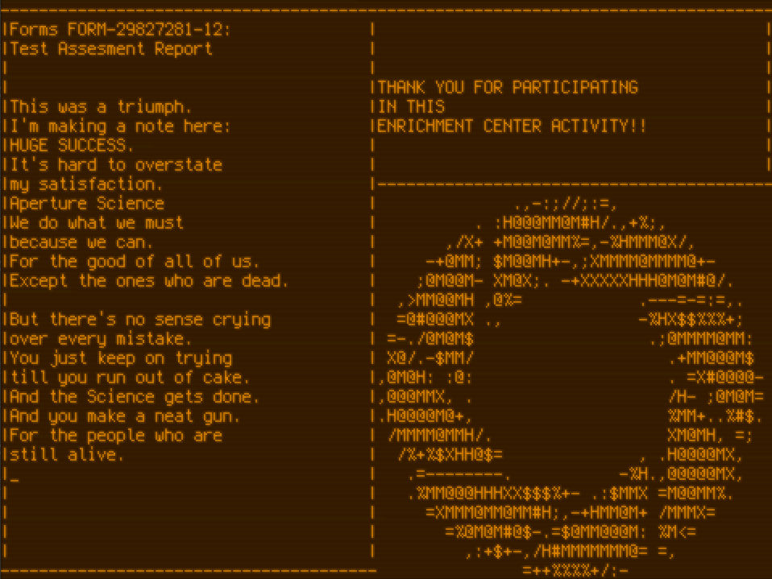

# Remake of the Portal game credits ('Still Alive' song)

## Screenshot

## Full video

## Explanation

This application is implemented as an [archipelago](https://github.com/ivanp7/archipelago) plugin (`still-alive.so`).
It is a shared library, so it cannot be run directly, and relies on the Archipelago executable as an entry point.
Also, the entry executable needs configuration, because it is general purpose and have not intrinsic knowledge about specific plugins.
A script (`still-alive.py`) that creates a memory-mapped configuration file is required to run the application.

## Dependencies

* [archipelago](https://github.com/ivanp7/archipelago)
* SDL2

## Build dependencies

* gcc-compatible compiler (like clang)
* pkgconfig module for Python
* ninja

## How to build

0. Install the SDL2 library.

1. Clone and build the [archipelago](https://github.com/ivanp7/archipelago):
    * configure: `./configure.py` (`build.ninja` will be generated)
    * build: `ninja` (`build/archi` and `build/libarchipelago.a` will be built)

2. Build the SDL plugin in `archipelago/plugin/sdl/` subdirectory:
    * configure: `./configure.py` (`build.ninja` will be generated)
    * build: `ninja` (`build/libarchi-sdl.a` and `build/libarchi-sdl.so` will be built)

3. Export the following environment variables:
    * `ARCHI_IDIR`: path of `archipelago/include/` directory
    * `ARCHI_LIB`: pathname of `archipelago/build/libarchipelago.a` static library
    * `SDL_IDIR`: path of `archipelago/plugin/sdl/include/` directory
    * `SDL_LIB`: pathname of `archipelago/plugin/sdl/build/libarchi-sdl.a` static library

4. Build this project:
    * configure: `./configure.py` (`build.ninja` will be generated)
    * build: `ninja` (`still-alive.so` will be built)

## How to run

0. Export the following environment variables:
    * `PYTHONPATH`: path of `archipelago/python/` directory
    * `LD_LIBRARY_PATH`: colon-separated (':') paths to directories where the shared libraries (`libarchi-sdl.so`, `still-alive.so`) reside
1. Run `./still-alive.py /tmp/still-alive.bin` to create the memory-mapped configuration file.
2. Run the Archipelago app, providing it the configuration file: `archipelago/build/archi /tmp/still-alive.bin`.

